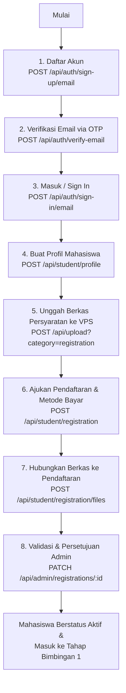

# Dokumentasi API SIBITA - Alur Registrasi Mahasiswa Baru

Dokumentasi ini menjelaskan langkah-langkah dan spesifikasi API untuk alur registrasi mahasiswa baru pada sistem SIBITA (Sistem Bimbingan Tugas Akhir), mulai dari pendaftaran akun hingga verifikasi berkas dan pembayaran oleh Admin.

---

## 🗺️ Gambaran Umum Alur Registrasi (Flowchart)

Berikut adalah urutan proses registrasi mahasiswa dari awal hingga berstatus **aktif**:



---

## 🔐 1. Autentikasi & Pembuatan Akun

### A. Pendaftaran Akun Baru (Sign Up)
Mendaftarkan akun baru ke sistem dengan peran (*role*) default sebagai `student`. Proses ini akan mengirimkan kode verifikasi OTP (6 digit) ke email terdaftar secara otomatis.

* **Endpoint:** `POST /api/auth/sign-up/email`
* **Autentikasi:** Tidak ada (Publik)
* **Content-Type:** `application/json`
* **Request Body:**
  * `name` (string, wajib): Nama lengkap mahasiswa.
  * `email` (string, wajib): Email mahasiswa (disarankan menggunakan email institusi, contoh: `budi@student.unud.ac.id`).
  * `password` (string, wajib): Kata sandi minimal 8 karakter.

#### Contoh Request Body
```json
{
  "name": "Budi Utomo",
  "email": "budi@student.unud.ac.id",
  "password": "securepassword123"
}
```

#### Contoh Response (200 OK)
```json
{
  "user": {
    "id": "c7a8b9c0-d1e2-4f3g-8h9i-j0k1l2m3n4o5",
    "name": "Budi Utomo",
    "email": "budi@student.unud.ac.id",
    "role": "student",
    "emailVerified": false,
    "createdAt": "2026-07-14T08:00:00.000Z",
    "updatedAt": "2026-07-14T08:00:00.000Z"
  },
  "token": "session_token_example_here"
}
```

---

### B. Verifikasi Email (OTP Verification)
Melakukan verifikasi alamat email menggunakan kode OTP 6-digit yang dikirimkan ke email pendaftar.

* **Endpoint:** `POST /api/auth/verify-email`
* **Autentikasi:** Tidak ada (Publik)
* **Content-Type:** `application/json`
* **Request Body:**
  * `email` (string, wajib): Alamat email yang didaftarkan.
  * `otp` (string, wajib): Kode OTP 6-digit yang diterima (berlaku selama 10 menit).

#### Contoh Request Body
```json
{
  "email": "budi@student.unud.ac.id",
  "otp": "123456"
}
```

#### Contoh Response (200 OK)
```json
{
  "status": "success",
  "message": "Email verified successfully"
}
```

---

### C. Masuk ke Sistem (Sign In)
Masuk ke sistem menggunakan email dan password untuk mendapatkan cookie sesi autentikasi.

* **Endpoint:** `POST /api/auth/sign-in/email`
* **Autentikasi:** Tidak ada (Publik)
* **Content-Type:** `application/json`
* **Request Body:**
  * `email` (string, wajib): Email terdaftar.
  * `password` (string, wajib): Kata sandi akun.

#### Contoh Request Body
```json
{
  "email": "budi@student.unud.ac.id",
  "password": "securepassword123"
}
```

#### Contoh Response (200 OK)
```json
{
  "user": {
    "id": "c7a8b9c0-d1e2-4f3g-8h9i-j0k1l2m3n4o5",
    "name": "Budi Utomo",
    "email": "budi@student.unud.ac.id",
    "role": "student",
    "emailVerified": true,
    "createdAt": "2026-07-14T08:00:00.000Z",
    "updatedAt": "2026-07-14T08:00:00.000Z"
  },
  "session": {
    "id": "session_id_example",
    "userId": "c7a8b9c0-d1e2-4f3g-8h9i-j0k1l2m3n4o5",
    "expiresAt": "2026-07-21T08:00:00.000Z"
  }
}
```

> [!NOTE]
> Setelah berhasil login, cookie sesi (`session_token`) akan diset secara otomatis oleh browser/klien HTTP.

---

## 👤 2. Pengisian Profil Mahasiswa

Setelah masuk pertama kali, mahasiswa wajib membuat data profil akademik. Profil mahasiswa hanya dapat dibuat **satu kali** (akan mengembalikan error `409` jika dicoba kembali).

* **Endpoint:** `POST /api/student/profile`
* **Autentikasi:** Wajib (Role: `student`)
* **Content-Type:** `application/json`
* **Request Body:**
  * `campus` (string, wajib): Nama universitas/kampus asal.
  * `nim` (string, wajib): Nomor Induk Mahasiswa.
  * `studyProgram` (string, wajib): Program studi.
  * `title` (string, opsional): Usulan judul skripsi awal.
  * `education` (string, wajib): Jenjang pendidikan, pilihan: `"S1" | "S2" | "S3"`. Default: `"S1"`.
  * `phoneNumber` (string, opsional): Nomor HP/WhatsApp aktif (jika diisi, akan memperbarui data telepon user).

#### Contoh Request Body
```json
{
  "campus": "Universitas Udayana",
  "nim": "2005551001",
  "studyProgram": "Teknologi Informasi",
  "title": "Rancang Bangun Sistem Informasi Bimbingan Tugas Akhir Berbasis Web",
  "education": "S1",
  "phoneNumber": "081234567890"
}
```

#### Contoh Response (201 Created)
```json
{
  "profile": {
    "userId": "c7a8b9c0-d1e2-4f3g-8h9i-j0k1l2m3n4o5",
    "campus": "Universitas Udayana",
    "nim": "2005551001",
    "studyProgram": "Teknologi Informasi",
    "title": "Rancang Bangun Sistem Informasi Bimbingan Tugas Akhir Berbasis Web",
    "education": "S1",
    "status": "nonactive",
    "createdAt": "2026-07-14T08:30:00.000Z",
    "updatedAt": "2026-07-14T08:30:00.000Z"
  }
}
```

---

## 📤 3. Pengunggahan Dokumen Persyaratan ke VPS

Sebelum mengajukan berkas pendaftaran ke database, mahasiswa harus mengunggah file fisiknya ke penyimpanan server VPS menggunakan endpoint upload umum.

* **Endpoint:** `POST /api/upload`
* **Query Parameter:** `category=registration` (Direkomendasikan untuk menyimpannya di folder registrasi)
* **Autentikasi:** Wajib (Semua Role Terautentikasi)
* **Content-Type:** `multipart/form-data`
* **Request Body (Form Data):**
  * `file` (binary file, wajib): File berformat **PDF** atau **DOCX** (Maksimal **20MB**).
  * `category` (string, opsional): Kategori folder penyimpanan jika tidak dilewatkan lewat query parameter.

#### Contoh Response (201 Created)
```json
{
  "success": true,
  "fileName": "bukti_ukt_semester_akhir.pdf",
  "fileUrl": "http://localhost:3001/uploads/registrations/f2711ab4-f481-42cb-b1b7-d1cb27f8a9e0.pdf",
  "fileType": "application/pdf",
  "fileSize": 450300,
  "category": "registrations"
}
```

---

## 📋 4. Pembuatan Pengajuan Pendaftaran

Membuat entri dokumen pendaftaran baru dan menentukan pilihan metode pembayaran.

* **Endpoint:** `POST /api/student/registration`
* **Autentikasi:** Wajib (Role: `student`)
* **Content-Type:** `application/json`
* **Request Body:**
  * `paymentOption` (string, wajib): Metode pembayaran, pilihan:
    * `"full"` : Bayar lunas di depan.
    * `"installment_2x"` : Cicilan 2 kali.
    * `"installment_3x"` : Cicilan 3 kali.
    * `"installment_4x"` : Cicilan 4 kali.
    * `"pay_at_end"` : Pembayaran ditangguhkan di akhir.
  * `totalAmount` (integer, opsional): Total biaya pendaftaran (Default: `2000000` / 2 juta rupiah).

#### Contoh Request Body
```json
{
  "paymentOption": "installment_2x",
  "totalAmount": 2000000
}
```

#### Contoh Response (201 Created)
```json
{
  "registration": {
    "id": "reg-5566-7788-99aa",
    "studentId": "c7a8b9c0-d1e2-4f3g-8h9i-j0k1l2m3n4o5",
    "paymentOption": "installment_2x",
    "totalAmount": 2000000,
    "status": "pending",
    "approvedBy": null,
    "approvedAt": null,
    "createdAt": "2026-07-14T08:45:00.000Z",
    "updatedAt": "2026-07-14T08:45:00.000Z"
  }
}
```

---

## 💾 5. Menghubungkan Berkas Registrasi ke Database

Setelah mengunggah file ke VPS (Langkah 3) dan membuat pengajuan pendaftaran (Langkah 4), mahasiswa harus mengirimkan metadata file tersebut untuk dikaitkan dengan pendaftarannya di database.

Mahasiswa umumnya wajib mengunggah:
1. Berkas **UKT** (`type: "ukt"`)
2. Berkas **Kontrak Kuliah** (`type: "contract"`)
3. **Bukti Pembayaran** (`type: "payment_proof"`) jika ada cicilan yang dibayarkan.

* **Endpoint:** `POST /api/student/registration/files`
* **Autentikasi:** Wajib (Role: `student`)
* **Content-Type:** `application/json`
* **Request Body:**
  * `type` (string, wajib): Tipe dokumen, pilihan: `"ukt" | "contract" | "payment_proof"`.
  * `fileName` (string, wajib): Nama berkas asli (misal: `"bukti_ukt.pdf"`).
  * `fileUrl` (string, wajib): URL file yang didapatkan dari respon `POST /api/upload`.
  * `fileType` (string, opsional): MIME type (contoh: `"application/pdf"`).
  * `fileSize` (integer, opsional): Ukuran file dalam bytes (contoh: `450300`).
  * `registrationPaymentId` (string, kondisional): **Wajib diisi** jika tipe dokumen adalah `"payment_proof"`. Kosongkan jika `"ukt"` atau `"contract"`.

#### Contoh Request (Unggah UKT/Kontrak)
```json
{
  "type": "ukt",
  "fileName": "bukti_ukt_semester_akhir.pdf",
  "fileUrl": "http://localhost:3001/uploads/registrations/f2711ab4-f481-42cb-b1b7-d1cb27f8a9e0.pdf",
  "fileType": "application/pdf",
  "fileSize": 450300
}
```

#### Contoh Request (Unggah Bukti Bayar Cicilan)
```json
{
  "type": "payment_proof",
  "fileName": "bukti_bayar_cicilan1.pdf",
  "fileUrl": "http://localhost:3001/uploads/registrations/e1022bc3-a551-4f11-ba3c-a9c02013f99e.pdf",
  "fileType": "application/pdf",
  "fileSize": 312000,
  "registrationPaymentId": "pay-rec-1122-3344"
}
```

#### Contoh Response (201 Created)
```json
{
  "file": {
    "id": "file-uuid-example",
    "registrationId": "reg-5566-7788-99aa",
    "registrationPaymentId": null,
    "type": "ukt",
    "fileName": "bukti_ukt_semester_akhir.pdf",
    "fileUrl": "http://localhost:3001/uploads/registrations/f2711ab4-f481-42cb-b1b7-d1cb27f8a9e0.pdf",
    "fileType": "application/pdf",
    "fileSize": 450300,
    "createdAt": "2026-07-14T08:50:00.000Z"
  }
}
```

---

## 🔍 6. Memeriksa Progres Registrasi Mandiri

Mahasiswa dapat melihat status pengajuan pendaftaran, daftar file yang telah berhasil diunggah, serta daftar cicilan/riwayat pembayaran.

* **Endpoint:** `GET /api/student/registration`
* **Autentikasi:** Wajib (Role: `student`)

#### Contoh Response (200 OK)
```json
{
  "registration": {
    "id": "reg-5566-7788-99aa",
    "studentId": "c7a8b9c0-d1e2-4f3g-8h9i-j0k1l2m3n4o5",
    "paymentOption": "installment_2x",
    "totalAmount": 2000000,
    "status": "pending",
    "approvedBy": null,
    "approvedAt": null,
    "createdAt": "2026-07-14T08:45:00.000Z",
    "updatedAt": "2026-07-14T08:45:00.000Z",
    "files": [
      {
        "id": "file-uuid-example",
        "registrationId": "reg-5566-7788-99aa",
        "registrationPaymentId": null,
        "type": "ukt",
        "fileName": "bukti_ukt_semester_akhir.pdf",
        "fileUrl": "http://localhost:3001/uploads/registrations/f2711ab4-f481-42cb-b1b7-d1cb27f8a9e0.pdf",
        "fileType": "application/pdf",
        "fileSize": 450300,
        "createdAt": "2026-07-14T08:50:00.000Z"
      }
    ],
    "payments": [
      {
        "id": "pay-rec-1122-3344",
        "registrationId": "reg-5566-7788-99aa",
        "installment": 1,
        "amount": 1000000,
        "status": "processing",
        "paidAt": null,
        "note": null,
        "createdAt": "2026-07-14T08:45:00.000Z",
        "files": []
      },
      {
        "id": "pay-rec-5566-7788",
        "registrationId": "reg-5566-7788-99aa",
        "installment": 2,
        "amount": 1000000,
        "status": "processing",
        "paidAt": null,
        "note": null,
        "createdAt": "2026-07-14T08:45:00.000Z",
        "files": []
      }
    ]
  }
}
```

---

## 🛡️ 7. Tahap Pasca Registrasi (Verifikasi Admin)

Setelah seluruh berkas diunggah, Admin atau Superadmin akan melakukan verifikasi:

### A. Persetujuan Pendaftaran (Approve Registration)
Mengubah status pendaftaran mahasiswa dari `pending` menjadi `approved` atau `rejected`.

* **Endpoint:** `PATCH /api/admin/registrations/:id`
* **Autentikasi:** Wajib (Role: `admin` | `superadmin`)
* **Request Body:**
  ```json
  {
    "status": "approved"
  }
  ```

> [!IMPORTANT]
> Ketika Admin mengubah status pendaftaran mahasiswa menjadi `"approved"`:
> 1. Status akun mahasiswa (`studentProfile.status`) otomatis berubah menjadi `"active"`.
> 2. Progres bimbingan mahasiswa diinisialisasi dan masuk ke tahapan bimbingan pertama (Tahap 1 - Pengusulan Topik).
> 3. Entri catatan bimbingan (`stage_note`) sebanyak 17 tahapan digenerasi otomatis untuk mahasiswa tersebut.

---

### B. Persetujuan Pembayaran (Approve Payment)
Mengubah status pembayaran cicilan mahasiswa tertentu menjadi `paid` setelah bukti transfer diverifikasi.

* **Endpoint:** `PATCH /api/admin/payments/:paymentId`
* **Autentikasi:** Wajib (Role: `admin` | `superadmin`)
* **Request Body:**
  ```json
  {
    "status": "paid",
    "note": "Pembayaran cicilan pertama terverifikasi lunas."
  }
  ```
