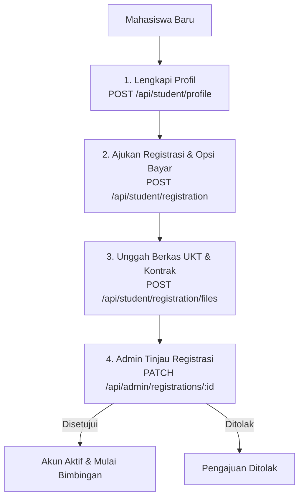

# Dokumentasi API SIBITA - Registrasi Mahasiswa

Dokumentasi ini menjelaskan spesifikasi API yang digunakan untuk proses registrasi mahasiswa pada sistem SIBITA, baik dari sisi **Mahasiswa** untuk pengajuan profil/pembayaran maupun **Admin** untuk verifikasi dan persetujuan.

---

## 🗺️ Alur Registrasi (Flowchart)



---

## 📡 Endpoint API Mahasiswa (Student)

Semua endpoint ini memerlukan autentikasi dengan role `student`.

### 1. Buat Profil Mahasiswa (Create Profile)
Mengisi data profil akademis mahasiswa sebelum mengajukan registrasi.
* **Endpoint:** `POST /api/student/profile`
* **Content-Type:** `application/json`
* **Request Body:**
  * `name` (string, opsional): Nama lengkap mahasiswa.
  * `campus` (string, opsional): Nama kampus.
  * `nim` (string, opsional): Nomor Induk Mahasiswa.
  * `studyProgram` (string, opsional): Program studi.
  * `title` (string, opsional): Judul penelitian sementara.
  * `education` (enum: `"S1" | "S2" | "S3"`, opsional): Jenjang pendidikan.
  * `phoneNumber` (string, opsional): Nomor telepon.

#### Contoh Request Body
```json
{
  "name": "Mahasiswa SIBITA",
  "campus": "Universitas SIBITA",
  "nim": "10115001",
  "studyProgram": "Teknik Informatika",
  "education": "S1",
  "phoneNumber": "081234567890"
}
```

---

### 2. Ambil Profil Mahasiswa (Get Profile)
Mengambil informasi lengkap profil akademis mahasiswa yang sedang login beserta dosen pembimbingnya (jika sudah di-assign).
* **Endpoint:** `GET /api/student/profile`

---

### 3. Ajukan Registrasi & Opsi Pembayaran (Create Registration)
Membuat pengajuan registrasi dengan memilih opsi pembayaran, total tagihan, serta mengunggah berkas UKT secara langsung (opsional). Endpoint ini mendukung format **JSON** dan **multipart/form-data** (untuk unggah file langsung).

* **Endpoint:** `POST /api/student/registration`
* **Content-Type:** `application/json` atau `multipart/form-data`
* **Payload (JSON):**
  * `paymentOption` (enum, wajib): `"full" | "installment_2x" | "installment_3x" | "installment_4x" | "pay_at_end"`.
  * `totalAmount` (number, opsional): Total biaya registrasi (default `2000000`).
  * `uktFile` (object, opsional): Detail berkas UKT yang sudah diunggah sebelumnya (`fileName`, `fileUrl`, `fileType`, `fileSize`).
* **Payload (multipart/form-data):**
  * `paymentOption` (string, wajib): Pilihan opsi pembayaran.
  * `totalAmount` (string/number, opsional): Total biaya registrasi.
  * `file` (file, opsional): File fisik bukti UKT (PDF, DOCX, PNG, JPEG).

#### Contoh Request Body (JSON)
```json
{
  "paymentOption": "installment_4x",
  "totalAmount": 2000000,
  "uktFile": {
    "fileName": "Bukti_UKT.pdf",
    "fileUrl": "https://example.com/files/bukti_ukt.pdf"
  }
}
```

---

### 3b. Unggah Berkas UKT Secara Langsung (Upload UKT File)
Mengunggah file bukti UKT secara langsung menggunakan `multipart/form-data` untuk pengajuan registrasi yang sudah dibuat.
* **Endpoint:** `POST /api/student/registration/upload-ukt`
* **Content-Type:** `multipart/form-data`
* **Request Body:**
  * `file` (file, wajib): File fisik bukti UKT (PDF, DOCX, PNG, JPEG, maks 20MB).

---

### 3c. Unggah Berkas Kontrak atau Bukti Bayar Secara Langsung (Upload Contract or Payment Proof File)
Mengunggah file lembar kontrak atau bukti pembayaran cicilan secara langsung menggunakan `multipart/form-data`.
* **Endpoint:** `POST /api/student/registration/upload`
* **Content-Type:** `multipart/form-data`
* **Request Body:**
  * `type` (string, wajib): `"contract" | "payment_proof"`.
  * `file` (file, wajib): File fisik lembar kontrak / bukti bayar (PDF, DOCX, PNG, JPEG, maks 20MB).
  * `registrationPaymentId` (string, wajib jika `type` adalah `"payment_proof"`): UUID data cicilan pembayaran terkait.

---

### 4. Ambil Status Registrasi Saya (Get My Registration)
Mendapatkan rincian data registrasi saat ini, berkas yang diunggah, serta status cicilan pembayaran.
* **Endpoint:** `GET /api/student/registration`

---

### 5. Unggah Berkas Registrasi / Bukti Bayar (Upload File)
Mengunggah berkas persyaratan registrasi seperti bukti UKT, lembar kontrak, atau bukti pembayaran cicilan.
* **Endpoint:** `POST /api/student/registration/files`
* **Content-Type:** `application/json`
* **Request Body:**
  * `type` (enum, wajib): `"ukt" | "contract" | "payment_proof"`.
  * `fileName` (string, wajib): Nama berkas.
  * `fileUrl` (string, wajib): URL berkas yang terunggah.
  * `fileSize` (number, opsional): Ukuran berkas dalam bytes.
  * `registrationPaymentId` (string, wajib jika `type` adalah `"payment_proof"`): UUID data cicilan pembayaran terkait.

#### Contoh Request Body
```json
{
  "type": "ukt",
  "fileName": "Bukti_UKT.pdf",
  "fileUrl": "https://example.com/files/bukti_ukt.pdf",
  "fileSize": 204800
}
```

---

### 6. Hapus Berkas Registrasi (Delete Registration File)
Menghapus data berkas registrasi dari database sekaligus menghapus file fisiknya dari server. Penghapusan ini hanya diizinkan apabila status registrasi masih `"pending"`.
* **Endpoint:** `DELETE /api/student/registration/files/:fileId`
* **URL Params:**
  * `fileId` (string, wajib): UUID berkas registrasi yang akan dihapus.

---