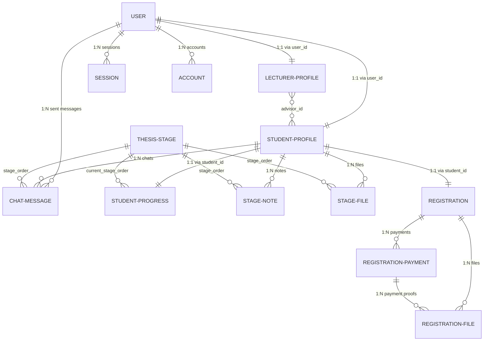

# SIBITA Database Schema Documentation (Drizzle ORM)

This document provides a highly structured overview of the PostgreSQL database schema for the **SIBITA (Sistem Bimbingan Tugas Akhir)** platform. It is designed to be easily read, parsed, and understood by AI coding agents and developers.

Reference source file: [db/schema.ts](file:///Volumes/External/Projects/API/joki-skripsi-api/db/schema.ts)

---

## ─── Entity Relationship Diagram ────────────────────────

---

## ─── Database Enums ─────────────────────────────────────

| Enum Name | Values | Description |
| :--- | :--- | :--- |
| `educationEnum` | `S1`, `S2`, `S3` | Academic degree levels. |
| `roleEnum` | `superadmin`, `admin`, `lecturer`, `student` | User authorization roles. |
| `statusEnum` | `active`, `nonactive`, `ended` | Student profile status. |
| `progressStatusEnum` | `not started`, `in progress`, `completed` | Thesis progression status. |
| `paymentOptionEnum` | `full`, `installment_2x`, `installment_3x`, `installment_4x`, `pay_at_end` | Student payment packages. |
| `registrationStatusEnum` | `pending`, `approved`, `rejected` | Admission approval status. |
| `registrationFileTypeEnum` | `ukt`, `contract`, `payment_proof` | Registration document types. |
| `paymentStatusEnum` | `processing`, `paid`, `rejected` | Installment payment states. |
| `referenceFileTypeEnum` | `guideline`, `template`, `example` | Academic reference file categories. |
| `stageFileTypeEnum` | `student`, `lecturer` | Originator of the stage file. |
| `stageNoteStatusEnum` | `pending`, `approved` | Supervisor approval status for a stage form/note. |

---

## ─── Table Details ──────────────────────────────────────

### 1. `user`
Central accounts table managed via Better Auth.
* **Fields**:
  * `id` (`text`, Primary Key) - Unique UUID/auth identifier.
  * `name` (`text`, Not Null) - Full name.
  * `email` (`text`, Not Null, Unique) - Auth email.
  * `emailVerified` (`boolean`, Default `false`) - Better Auth verification.
  * `image` (`text`, Nullable) - Profile picture URL.
  * `phoneNumber` (`text`, Nullable) - Phone contact.
  * `role` (`roleEnum`, Default `student`) - Authorization role.
  * `createdAt` (`timestamp`, Default `now()`) - Registration timestamp.
  * `updatedAt` (`timestamp`, Default `now()`) - Last profile update.

### 2. `student_profile`
Contains academic-specific details for students.
* **Fields**:
  * `userId` (`text`, Primary Key, FK `user.id`, ON DELETE CASCADE) - Maps 1:1 with `user` table.
  * `campus` (`text`, Nullable) - College/Campus name.
  * `nim` (`text`, Nullable) - Student Registration Number.
  * `studyProgram` (`text`, Nullable) - Major/Department.
  * `title` (`text`, Nullable) - Approved thesis title.
  * `education` (`educationEnum`, Default `S1`) - Academic tier.
  * `status` (`statusEnum`, Default `nonactive`) - Account thesis status.
  * `advisorId` (`text`, Nullable, FK `user.id`, ON DELETE SET NULL) - Assigned supervisor lecturer ID.
* **Indexes**:
  * Index on `advisorId` for fast filtering.

### 3. `student_progress`
Tracks the current progress order of students within the 17-stage thesis pipeline.
* **Fields**:
  * `studentId` (`text`, Primary Key, FK `student_profile.userId`, ON DELETE CASCADE) - 1:1 with student profile.
  * `currentStageOrder` (`integer`, Nullable, FK `thesis_stage.order`, ON DELETE SET NULL) - Current active thesis stage.
  * `startedAt` (`timestamp`, Default `now()`) - Thesis commencement date.
  * `status` (`progressStatusEnum`, Default `not started`) - Progression flag.
  * `finishedAt` (`timestamp`, Nullable) - Date of thesis completion/graduation.
  * `updatedAt` (`timestamp`, Default `now()`) - Record update timestamp.

### 4. `lecturer_profile`
Contains academic details for faculty supervisors.
* **Fields**:
  * `userId` (`text`, Primary Key, FK `user.id`, ON DELETE CASCADE) - Maps 1:1 with `user` table.
  * `nidn` (`text`, Unique, Nullable) - National Lecturer Identification Number.
  * `campus` (`text`, Nullable) - College/Campus name.
  * `department` (`text`, Nullable) - Faculty department.

### 5. `thesis_stage`
Master table defining the 17 chronological steps of the thesis process.
* **Fields**:
  * `order` (`integer`, Primary Key) - Stage sequence number (1 to 17).
  * `name` (`text`, Not Null) - Stage name (e.g., "Pengajuan Judul", "Sidang Akhir").
  * `durationDays` (`integer`, Not Null) - Recommended deadline in days.
  * `createdAt` (`timestamp`, Default `now()`) - Insertion timestamp.

### 6. `stage_note`
Form responses and feedback notes submitted per stage.
* **Fields**:
  * `id` (`text`, Primary Key) - UUID.
  * `studentId` (`text`, Not Null, FK `student_profile.userId`, ON DELETE CASCADE) - Student owner.
  * `stageOrder` (`integer`, Not Null, FK `thesis_stage.order`, ON DELETE CASCADE) - Stage reference.
  * `data` (`jsonb`, Nullable) - Flexible form data fields (Zod verified dynamically).
  * `comment` (`text`, Nullable) - Dosen advisor's review feedback.
  * `status` (`stageNoteStatusEnum`, Default `pending`) - Approval status by supervisor.
  * `createdAt` (`timestamp`, Default `now()`) - Submission date.
  * `completedAt` (`timestamp`, Nullable) - Approval date.
* **Indexes**:
  * Indexes on `studentId` and `stageOrder`.

### 7. `stage_file`
Files uploaded by students or lecturers for specific thesis stages.
* **Fields**:
  * `id` (`text`, Primary Key) - UUID.
  * `studentId` (`text`, Not Null, FK `student_profile.userId`, ON DELETE CASCADE) - Student folder reference.
  * `stageOrder` (`integer`, Not Null, FK `thesis_stage.order`, ON DELETE CASCADE) - Stage number.
  * `fileName` (`text`, Not Null) - Original filename.
  * `fileUrl` (`text`, Not Null) - Public URL link on the server.
  * `fileType` (`text`, Nullable) - Mime-type.
  * `fileSize` (`integer`, Nullable) - File size in bytes.
  * `type` (`stageFileTypeEnum`, Default `student`) - Upload source indicator.
* **Indexes**:
  * Indexes on `studentId` and `stageOrder`.

### 8. `chat_message`
Real-time consultation logs between the student and their designated advisor, organized by thesis stage.
* **Fields**:
  * `id` (`text`, Primary Key) - UUID.
  * `studentId` (`text`, Not Null, FK `student_profile.userId`, ON DELETE CASCADE) - Chat room scope.
  * `senderId` (`text`, Not Null, FK `user.id`, ON DELETE CASCADE) - Message sender (student or advisor).
  * `stageOrder` (`integer`, Not Null, FK `thesis_stage.order`, ON DELETE CASCADE) - Stage-specific chat channel.
  * `message` (`text`, Nullable) - Message body.
  * `fileName` (`text`, Nullable) - Attachment name.
  * `fileUrl` (`text`, Nullable) - Attachment URL.
  * `fileType` (`text`, Nullable) - Attachment Mime-type.
  * `fileSize` (`integer`, Nullable) - Attachment size in bytes.
* **Indexes**:
  * Indexes on `studentId` and `stageOrder`.

### 9. `registration`
Controls student registration, admission payments, and approval status.
* **Fields**:
  * `id` (`text`, Primary Key) - UUID.
  * `studentId` (`text`, Not Null, Unique, FK `student_profile.userId`, ON DELETE CASCADE) - 1:1 relationship with student.
  * `paymentOption` (`paymentOptionEnum`, Not Null) - Selection package.
  * `totalAmount` (`integer`, Default `2000000`) - Total pricing contract (default 2 Million IDR).
  * `status` (`registrationStatusEnum`, Default `pending`) - Admission state.
  * `approvedBy` (`text`, Nullable, FK `user.id`, ON DELETE SET NULL) - Admin ID who approved.
  * `approvedAt` (`timestamp`, Nullable) - Approval date.
* **Indexes**:
  * Indexes on `studentId` and `status`.

### 10. `registration_file`
Documents uploaded to support registration approvals.
* **Fields**:
  * `id` (`text`, Primary Key) - UUID.
  * `registrationId` (`text`, Not Null, FK `registration.id`, ON DELETE CASCADE) - Associated registration profile.
  * `registrationPaymentId` (`text`, Nullable, FK `registration_payment.id`, ON DELETE CASCADE) - Populated only for `payment_proof`.
  * `type` (`registrationFileTypeEnum`, Not Null) - e.g., `ukt`, `contract`, `payment_proof`.
  * `fileName` (`text`, Not Null) - Filename.
  * `fileUrl` (`text`, Not Null) - File download URL.
  * `fileType` (`text`, Nullable) - Mime-type.
  * `fileSize` (`integer`, Nullable) - File size.
* **Indexes**:
  * Indexes on `registrationId`, `registrationPaymentId`, and `type`.

### 11. `registration_payment`
Tracks installment cycles for student registrations.
* **Fields**:
  * `id` (`text`, Primary Key) - UUID.
  * `registrationId` (`text`, Not Null, FK `registration.id`, ON DELETE CASCADE) - Parent registration.
  * `installment` (`integer`, Not Null) - Installment index (e.g. 1, 2, 3, 4).
  * `amount` (`integer`, Not Null) - Price for this installment term.
  * `status` (`paymentStatusEnum`, Default `processing`) - Installment payment status.
  * `paidAt` (`timestamp`, Nullable) - Verified payment timestamp.
  * `note` (`text`, Nullable) - Admin correction or acceptance notes.
* **Indexes**:
  * Index on `registrationId`.

### 12. `reference_file`
Reference library (e.g., guidelines, formatting templates) uploaded by administration.
* **Fields**:
  * `id` (`text`, Primary Key) - UUID.
  * `title` (`text`, Not Null) - Title of reference.
  * `description` (`text`, Nullable) - Short reference summary.
  * `type` (`referenceFileTypeEnum`, Not Null) - guideline / template / example.
  * `fileName` (`text`, Not Null) - Original filename.
  * `fileUrl` (`text`, Not Null) - Upload URL.
  * `fileType` (`text`, Nullable) - Mime-type.
  * `fileSize` (`integer`, Nullable) - Size in bytes.
  * `author` (`text`, Nullable) - Document author/issuer.

### 13. Auth-Related Tables (Better Auth Core)
* `session`: Tracks user sessions. Fields: `id`, `expiresAt`, `token`, `ipAddress`, `userAgent`, `userId` (FK `user.id`).
* `account`: Third-party providers / OAuth links. Fields: `id`, `accountId`, `providerId`, `userId` (FK `user.id`), credentials, and tokens.
* `verification`: Verification codes/tokens. Fields: `id`, `identifier`, `value`, `expiresAt`.
